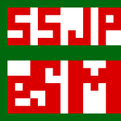

Este sitio web, así como el sistema de seguimiento que procesa la información y muestra las diversas gráficas estadístcas, contiene los datos recopilados solamente de dos ligas competitivas de nuestro país, GAMELTA y la Liga Mexicana de Videojuegos, siendo también de momento, llevado el seguimiento de jugadores mexicanos.

De igual forma, este sitio web es una pequeña forma de hacer crecer a la escena competitiva de eSports en nuestro país y se espera que también sirva de motivación no sólo para los jugadores profesionles o los que han ganado sólo un evento o torneo, sino para todo aquel jugador que aún no siendo competitivo o que no sea un seguidor de eSports, pueda al menos darse cuenta de las escalas a las que tanto los eSports, y también como nosotros como comunidad y competidores crecemos, y decida una o varias cosas de un sin fín de posibilidades dentro de estos deportes electrónicos.

Más adelante se incorporarían datos de más jugadores mexicanos pertenecientes a otras ligas extranjeras u a otras más del propio país, así como también se analiza el cómo incluir a los jugadores de diferentes nacionaliades que participan o participaron en las ligas mexicanas de eSports.

``` {r, echo=FALSE}
library(networkD3)
data(MisLinks, MisNodes)
forceNetwork(Links = MisLinks, Nodes = MisNodes, Source = "source",
             Target = "target", Value = "value", NodeID = "name",
             Group = "group", opacity = 0.3)
```