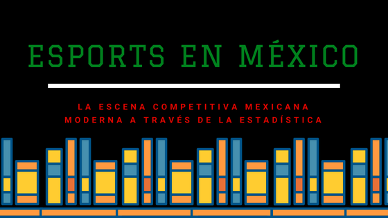

### ¡Hola a todos, bienvenidos al sitio web del Sistema de Seguimiento de Jugadores Profesionales de eSports en México!

En el sitio pueden navegar entre las diferentes páginas para conocer mediante gráficas, las estadísticas de los jugadores profesionales de eSports en nuestro país, así como estadísticas de las plataformas donde se compite y los videojuegos mismos, estos datos son de momento tomados sólo de las ligas GAMELTA y la Liga Mexicana de Videojuegos (mostrándose de igual forma estadísticas gráficas generales de ambas ligas).

